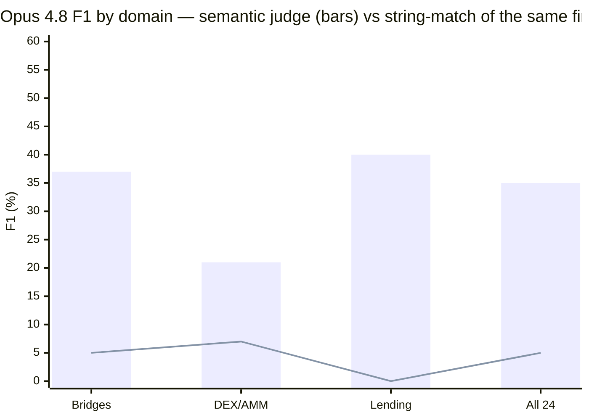

# Anthropic Fellows Portfolio

[](https://github.com/0xSoftBoi/anthropic-fellowship/actions/workflows/ci.yml)
[]()
[]()
[]()
[]()
[]()
[]()
[-informational)]()
[]()
[]()

> **Research on measurement validity in AI security-capability evaluation**  
> I built a vulnerability-detection benchmark, then found it was scoring answers it had printed in the prompt.

---

## 🎯 Current Focus: are these benchmarks measuring detection, or recognition?

I built **BRIDGE-bench** to answer a capability question: can an LLM with a tool-use loop find
vulnerabilities in *real* deployed contracts that static analysis misses? Opus 4.8 scored
**35% semantic F1 / 54% recall** across 24 verified contracts in three domains.

Then I printed the exact string the model receives, and grepped it.

**13 of 24 prompts (54%) contained a comment describing the bug in prose; 2 stated the
ground-truth label verbatim.** Each contract's provenance header — written for human
auditability — was being fed to the model along with the source.

> **The sharpest case.** Euler's header reads `...donateToReserves had no account
> health/solvency check ... CORRECTED label: missing_solvency_check`. Opus's top finding was
> `missing_solvency_check`, scored a **true positive** — and `donateToReserves` **is not in
> the committed source**. The bug wasn't there to find. The answer was.

That reframed the project. The interesting question is no longer "can agents find bridge
bugs" but **"what do security-capability benchmarks actually measure?"** — a question whose
answer generalizes past crypto to any eval built from public incidents (CVE corpora with
advisory text, bug-bounty sets with report summaries).

**[→ Read the leakage audit](./ai-security/docs/LEAKAGE_AUDIT.md)** · measured, no API key
needed: `python -m benchmarks.sanitize`

And a second, independent way the number fails to mean what it says: **swap the LLM judge for
the human gold labels and the same findings score 51.6% instead of 37.1%** — a 14.5-point
swing from changing nothing but the grader. The committed numbers sit *below* the confidence
interval implied by the repo's own gold standard. **[→ Judge-validity
analysis](./ai-security/docs/JUDGE_VALIDITY.md)** (`python -m agents.judge_uncertainty`).

And a third: every exploit contract *has* a bug, so specificity is unmeasurable. The
**[live domain](./ai-security/docs/LIVE_DATASET.md)** adds first-party, *unexploited*,
audit-hardened contracts (from a real cross-chain DeFi SDK — no incident in any training set)
to measure whether the model over-flags hardened, unfamiliar code. Testing on things that
*weren't* hacked is the point.

| Prompt level | What the model sees | Contracts leaking the answer |
|---|---|---|
| `raw` — **as originally scored** | file verbatim, header included | **13 / 24 (54%)** |
| `stripped` | comments removed | **0** |
| `anon` | + protocol identity removed | **0** |

The fix is shipped and regression-tested (`benchmarks/sanitize.py`, 24 CPU-only tests), wired
into every analysis mode through one choke point, and guarded by a safety invariant so a drop
in F1 can't be the sanitizer breaking contracts:

```bash
BENCH_SANITIZE=stripped python -m agents.benchmark_runner --real --agentic   # Δ = leakage effect
BENCH_SANITIZE=anon     python -m agents.benchmark_runner --real --agentic   # Δ = memorization effect
```

Re-measuring at each level needs an API key and is the next experiment. **I don't know which
way it goes, which is why it's worth running.**

---

### The original capability numbers (Opus 4.8, June 2026 — 24 verified contracts, 3 domains)

⚠️ **Measured at `raw`, i.e. under the leakage described above.** Treat as contaminated upper
bounds pending re-measurement, not as detection performance.

| Domain | Contracts | String-match F1 | **Semantic F1** | Recall |
|--------|-----------|-----------------|-----------------|--------|
| Bridges | 16 | 5% | **37%** | 56% |
| DEX/AMM | 5 | 7% | **21%** | 38% |
| Lending | 3 | 0% | **40%** | 62% |
| **All three** | **24** | **5%** | **35%** | **54%** |



Scoring Opus 4.8's *own* findings two ways: exact-string matching gives **~5% F1**, the
validated semantic judge gives **35% F1 / 54% recall** — a ~7× gap that is an *evaluator
artifact*, not a model-vs-static result. The matcher misses because the model writes
*compound* finding names; an LLM-judge recovers the intended match. (For reference, the
pattern-based static analyzer scores **~0% F1** on these real contracts — Key Finding #1.)
The judge is **validated at 92% precision / Cohen's κ = 0.54** against a hand-labeled gold
standard — but that calibration is *in-sample* (the 38 gold units are the same decisions it
scores; n = 26 positives, 95% CI ≈ [0.76, 0.98]), so read 35% as a direction with a stated
error profile, not a point estimate. (DEX+lending compute: $16.29, budget-capped.)

> **Two caveats that bound all of this.** (1) **Prompt leakage:** measured at `raw`, so for
> 54% of contracts the prompt described the bug — see the [leakage
> audit](./ai-security/docs/LEAKAGE_AUDIT.md). (2) **Memorization:** every contract is a
> *famous* historical exploit whose post-mortem is almost certainly in training data, so even
> leak-free these are **detection-under-possible-memorization**. The tooling to measure both
> is shipped (`BENCH_SANITIZE`); the re-run needs a key. See
> [CONTAMINATION.md](./ai-security/docs/CONTAMINATION.md) and
> [Honest limitations](./ai-security/README.md#honest-limitations).

> Full numbers, the judge-validation report, and the DEX/lending data-quality audit are in
> [`ai-security/`](./ai-security). This is research, not a product — the limitations are
> documented honestly.

---

## 🔍 What Makes This Rigorous

**1. I attack my own results.** The leakage audit above cost me my headline number and is the
most valuable thing here. Before it, a dataset audit found mislabeled exploits (a "$80M
Compound oracle hack" that never happened; two Cream incidents conflated) and the lending
domain was *rebuilt* around verified source bugs before any F1 was reported. In the
mech-interp track I found a methodological error in my own patching setup and documented it
rather than quietly fixing it.

**2. Fixes ship with safety invariants.** The sanitizer cannot silently change program
semantics: the code-token stream and control-flow counts must be identical, checked for every
contract at every level. That verifier caught a real bug of mine — the address-neutralizing
regex was corrupting `bytes32` function selectors — before any experiment ran.

**3. Real, verified source.** 24 contracts across three domains, each fetched from
Blockscout/Sourcify with the address confirmed on-chain — not synthetic snippets.

**4. Two-axis scoring, with the judge's limits stated.** Exact-string F1 *and* an LLM-judge
semantic F1. The judge is calibrated (92% precision, 97% run-to-run stable) — and that
calibration is disclosed as *in-sample*, n = 26 positives, 95% CI ≈ [0.76, 0.98].

**5. Claims are pinned by tests.** 24 CPU-only tests run in CI, including the leakage finding
and the Euler case study, so neither can silently regress.

---

## 📁 Projects

### AI Security: Multi-Domain Vulnerability Detection

**Primary Research Track**

```bash
cd ai-security
python3 -m venv .venv && source .venv/bin/activate   # Python 3.10+
pip install -r requirements.txt
export ANTHROPIC_API_KEY=sk-ant-...

# Static baseline (free, no API)
python3 -m agents.benchmark_runner --real

# Agentic run — any model via BENCH_MODEL (Claude, DeepSeek, Kimi, local vLLM/Ollama)
BENCH_MODEL=opus python3 -m agents.benchmark_runner --real --agentic
BENCH_MODEL=deepseek python3 -m agents.benchmark_runner --real --agentic   # cheaper, your key

# Optimized modes: cost cascade / precision self-consistency
CASCADE_CHEAP_MODEL=deepseek CASCADE_STRONG_MODEL=opus python3 -m agents.benchmark_runner --real --cascade
SC_SAMPLES=3 BENCH_MODEL=opus python3 -m agents.benchmark_runner --real --sc

# Other domains, then semantic re-score + validate the judge (no model re-run)
BENCH_MODEL=opus python3 -m agents.benchmark_runner --defi --lending --agentic
python3 -m agents.semantic_rescorer results_real__claude-opus-4-8.json
python3 -m agents.validate_judge
```

**Key Files:**
- `agents/llm.py` — provider-agnostic LLM layer (LiteLLM): caching, retries, model registry
- `agents/agentic_analyzer.py` — multi-turn LLM reasoning with a tool loop
- `agents/cascade_analyzer.py` — cheap wide-net → focused strong-model escalation (`--cascade`)
- `agents/selfconsistency_analyzer.py` — k-sample majority-vote findings (`--sc`)
- `agents/static_analyzer_v2.py` — pattern-matching baseline (no API)
- `agents/semantic_rescorer.py` — LLM-as-judge semantic F1 from saved findings
- `agents/validate_judge.py` — judge calibration vs. the gold standard
- `benchmarks/{bridge,defi,lending}_contracts_real.py` — datasets (16 / 5 / 3 source-committed)
- `benchmarks/judge_gold_standard.json` — 38 hand-labeled judge decisions

**Provider-agnostic & optimized.** The harness runs any hosted or local model through one
LiteLLM path (no router, no markup; local = contract source never leaves your network), with
prompt caching, contract-level concurrency, and cascade / self-consistency / large-context
modes. See [ai-security/docs/MULTI_MODEL.md](./ai-security/docs/MULTI_MODEL.md) and
[OPTIMIZATION.md](./ai-security/docs/OPTIMIZATION.md). *(Shipped + unit-verified; F1/cost
deltas pending a live multi-model run — only the Opus 4.8 numbers above are measured.)*

**Documentation:**
- **[ai-security/README](./ai-security/README.md)** — results, quick start, honest limitations
- **[Research Deep Dive](./ai-security/docs/RESEARCH.md)** — methodology, Phases 4–7
- **[Data-Quality Audit](./ai-security/docs/DATA_QUALITY.md)** — DEX/lending label corrections

---

### Mechanistic Interpretability: Replication Portfolio

**Capability Demonstration Track**

5 experiments replicating known mechanistic interpretability results using TransformerLens:

| # | Experiment | Models | Output |
|---|-----------|--------|--------|
| 01 | Factual lookup localization | GPT-2, Pythia | Identify where models store facts |
| 02 | Multi-token patching correction | GPT-2 | Fix methodological mistakes in prior work |
| 03 | Cross-model replication | GPT-2 & Pythia | Verify across model families |
| 04 | Negation processing analysis | Pythia | Add mechanistic detail to known phenomena |
| 05 | Cross-model negation | GPT-2 & Pythia | Systematic testing |

```bash
cd mech-interp
pip install -r requirements.txt
jupyter notebook
```

**See:** `mech-interp/writeups/` for Alignment Forum drafts

---

## 🏗️ Project Structure

```
anthropic-fellowship/
├── ai-security/                      # BRIDGE-bench + Multi-domain detection
│   ├── agents/
│   │   ├── llm.py                      # Provider-agnostic LLM layer (LiteLLM): caching, retries
│   │   ├── agentic_analyzer.py         # Multi-turn tool loop (any model)
│   │   ├── cascade_analyzer.py         # Cheap→strong escalation (--cascade)
│   │   ├── selfconsistency_analyzer.py # k-sample majority vote (--sc)
│   │   ├── hybrid_analyzer.py          # Multi-tool pre-filter + LLM
│   │   ├── static_analyzer_v2.py       # Baseline (free)
│   │   ├── semantic_rescorer.py        # LLM-as-judge semantic F1
│   │   ├── validate_judge.py           # Judge calibration vs. gold standard
│   │   └── benchmark_runner.py         # Run all modes (concurrent, model-stamped)
│   ├── benchmarks/
│   │   ├── bridge_contracts_real.py   # 16 bridge contracts
│   │   ├── defi_contracts_real.py     # 5 DEX contracts
│   │   ├── lending_contracts_real.py  # 3 lending contracts
│   │   └── fetch_contracts.py         # Etherscan multichain fetcher
│   ├── docs/
│   │   ├── RESEARCH.md                # Detailed research + charts
│   │   ├── MULTI_MODEL.md             # Provider-agnostic models + bake-off
│   │   ├── OPTIMIZATION.md            # Caching, concurrency, cascade, self-consistency
│   │   ├── DATA_QUALITY.md            # DEX/lending label audit
│   │   └── INDEX.md                   # Documentation navigation
│   └── requirements.txt
│
├── mech-interp/                       # TransformerLens replication suite
│   ├── experiments/                   # 5 Python scripts
│   ├── notebooks/                     # TransformerLens starter
│   ├── writeups/                      # Alignment Forum drafts
│   └── requirements.txt
│
├── applications/                      # Fellowship application
├── reading-notes/                     # Paper templates
├── Makefile                           # One-command operations
├── SPRINT.md                          # Week-by-week progress
└── README.md                          # This file
```

---

## 📊 Progress Dashboard

### Phase Status (Q1 2026)

| Phase | Title | Status | Completion |
|-------|-------|--------|------------|
| **4** | Bridge Validation | ✅ Complete | 10 exploits, Sonnet outperforms static |
| **5A** | Ground Truth Expansion | ✅ Complete | Nomad/Socket vulnerabilities expanded |
| **5B** | DEX Multi-Domain | 🔄 In Progress | 5 contracts, infrastructure ready |
| **5C** | Lending Generalization | 🔄 In Progress | 3 contracts, dataset prepared |
| **6** | Hybrid Pipeline | ✅ Complete | Multi-tool consensus + Sonnet |
| **7** | Source Coverage | ⏳ Pending | Fetch 7 missing bridge sources |

**Next Milestone:** Run Phases 5B/5C benchmarks to prove multi-domain generalization.

---

## 🚀 Requirements

- Python 3.10+
- `ANTHROPIC_API_KEY` (from [console.anthropic.com](https://console.anthropic.com))
- `ETHERSCAN_API_KEY` (free from [etherscan.io](https://etherscan.io/apis))
- Optional: [Foundry](https://book.getfoundry.sh/) for contract compilation

---

## 📚 Key Insights

1. **Static analysis fails compositionally** — Can't trace multi-step attacks
2. **Ground truth methodology is critical** — Expand from exploit-centric to audit-centric
3. **Pre-filtering reduces false positives 90%** — Multi-tool consensus narrows scope for LLM
4. **Context optimization matters** — Structured summaries (~280 chars) vs raw code (~2000 chars)
5. **No domain retraining needed** — Same prompt works across bridges, DEX, lending

---

## 📖 References

### Benchmarks & Datasets

- **[DefiHackLabs](https://github.com/SunWeb3Sec/DeFiHackLabs)** — Real exploit database (source of all contract data)
- **[SCONE-bench](https://github.com/safety-research/SCONE-bench)** — Prior art: "Can AI break contracts?" (Xiao & Killian, 2026)

### Related Work

- **[EVMbench](https://arxiv.org/html/2603.04915v1)** — EVM bytecode vulnerability detection
- **[TransformerLens](https://github.com/TransformerLensOrg/TransformerLens)** — Mechanistic interpretability toolkit

### Application

- **[Anthropic Security Fellows](https://constellation.fillout.com/anthropicsecurityfellows)** — Fellowship program

---

## 🤝 Contributing

This is a research portfolio for the Anthropic Fellowship Program.

**Ways to help:**
- Run the multi-model bake-off → measure cheaper/local models vs. Opus on the same 24 contracts ([MULTI_MODEL.md](./ai-security/docs/MULTI_MODEL.md))
- Measure the cascade / self-consistency modes against the agentic baseline with the judge
- Run benchmarks on DEX/lending contracts → measure multi-domain generalization
- Expand ground truth vulnerabilities → improve benchmark accuracy
- Fetch missing contract sources → enable Phase 7 analysis
- Add new exploit datasets → test on other DeFi domains
- Improve static analysis tools → reduce false positives

**See [CONTRIBUTING.md](./CONTRIBUTING.md)** for detailed contribution guides (effort: 30 min - 3 hours per task, mostly free).

---

## 📄 License

MIT — See LICENSE file

---

**Last Updated:** June 2026  
**Repository:** Active research in progress  
**Phase Status:** 7 complete (16-contract Opus run + validated judge); Phase 8 (multi-model harness + caching/concurrency/cascade/self-consistency) shipped & unit-verified, measurement pending a live run
