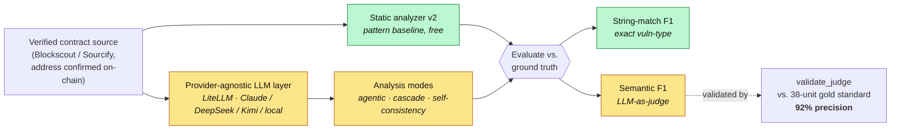
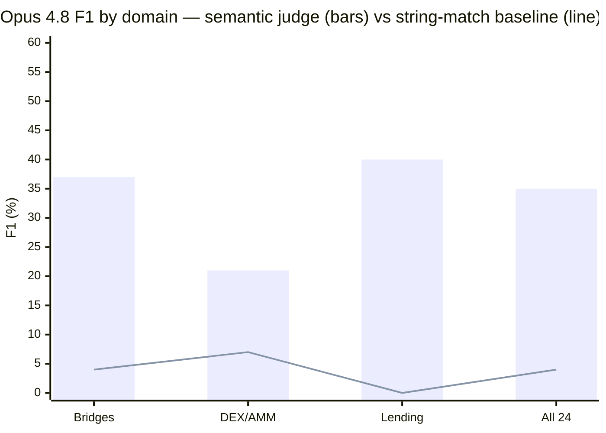
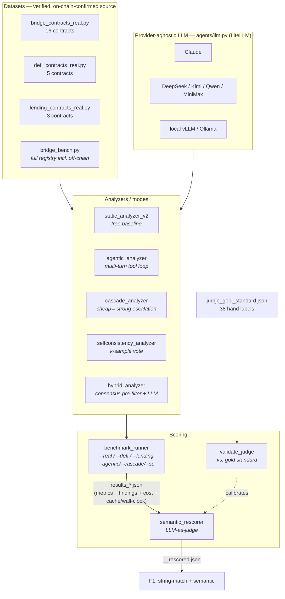

# AI Security Research: LLM-Driven Smart Contract Vulnerability Detection

> **Can LLMs with tool-use outperform static analysis on real smart contracts?**

Research demonstrating that compositional reasoning + multi-turn analysis beats pattern matching on real-world blockchain exploits.

---

## The Problem

**Static analysis fails on real contracts:**
- ✓ 55% F1 on clean, synthetic code
- ✗ 0% F1 on real contracts (with proxies, inheritance, custom patterns)

**Why?** Real code is structurally different. Vulnerabilities are compositional (flash loan + oracle + reentrancy = one exploit path). Pattern matching alone is insufficient.

---

## How it works



Every contract is analyzed two ways (static baseline + agentic LLM), and every LLM run is
scored two ways (exact-string **and** a *validated* semantic judge) — so the gap between
"found the bug" and "named it the way the label expects" is measured, not hidden.

**Measured run (June 2026) on 16 real verified contracts with committed source:**

Scored over the 16 real-source contracts (Opus run, `--real --agentic`):

| Approach | Precision | Recall | F1 | TP / FP / FN |
|----------|-----------|--------|----|--------------|
| Static v2 | 4% | 7% | **5%** | 3 / 80 / 38 |
| **Opus 4.8 — string-match scoring** | 4% | 7% | **5%** | 3 / 80 / 38 |
| **Opus 4.8 — semantic-judge scoring** | 28% | **56%** | **37%** | 23 / 60 / 18 |
| Fable 5 agentic | — | — | n/a | **refuses** the task (`stop_reason: refusal`) |
| Sonnet 4.6 (historical, unreproduced) | — | — | ~40–45% | original claim; never committed |

> **Why two Opus rows.** The benchmark's evaluator does near-exact string matching on
> vuln-type names. Opus 4.8 emits **compound, descriptive** finding names (e.g.
> `"arbitrary_external_call / approval_drain"`, `"forged_deposit_event /
> unauthenticated_memo"`, `"solvency_check_bypass"`, `"missing_message_source_validation"`)
> that are semantically correct but score as false positives — collapsing recall to 7%.
> `semantic_rescorer.py` (an LLM-as-judge, default Haiku) recomputes F1 from the
> **already-saved findings with no model re-run** (38 judge calls, ~17k tokens, ~$0.02):
> recall rises to **56%**, F1 to **37%**, with a correct root-cause hit on **15 of 16
> contracts** (only `sonne` is a genuine miss; the judge stays conservative on
> `nomad`/`penpie`, so it is not rubber-stamping). The residual false positives are
> mostly real-but-unlabeled observations (centralization, missing timelocks). This is
> the **ground-truth/scoring methodology problem** (Key Findings #2) reproduced at
> frontier-model scale: the model is far better than the matcher reports.

> **The judge is calibrated.** `agents/validate_judge.py` scores the Haiku judge against
> a frozen 38-unit hand-labeled gold standard (`benchmarks/judge_gold_standard.json`):
> **82% accuracy, 92% precision, 83% recall, Cohen's κ = 0.54, 97% run-to-run unanimous.**
> High precision ⇒ the judge rarely fabricates a match, so it does not inflate the model;
> its errors are conservative under-credits, making the **37% a lower bound**. The
> residual disagreement (moderate κ) sits almost entirely on labels flagged *borderline*
> in the gold file — genuine ambiguity, not judge noise.

> **Two model-specific findings from this run.**
> 1. **Fable 5 declines the task.** The newest model returns `stop_reason: refusal`
>    with empty output on smart-contract vulnerability-analysis prompts, across the
>    agentic harness, a single-turn JSON path, and an explicit *authorized
>    post-incident defensive audit* system prompt. Sonnet/Opus do not. A model that
>    refuses adversarial-code analysis cannot be benchmarked here as-is — itself a
>    citable result about safety-tuning vs. defensive-security utility.
> 2. **Newer models reject `temperature`.** Both `claude-fable-5` and
>    `claude-opus-4-8` 400 on an explicit `temperature` override; the analyzers now
>    omit it for those models and keep `temperature=0` only where supported.

> **Dataset status.** 16 of 20 registered contracts now have **real verified source**
> committed (fetched from Blockscout/Sourcify, addresses confirmed on-chain), up from
> 3. Remaining empties (`poly_network`, `ronin`, `orbit`, `lifi_march_2022`) are either
> verified only on Etherscan (needs a key) or off-chain key-compromise hacks with no
> source-level bug to detect. Select a model with `BENCH_MODEL` (`sonnet` default,
> `opus`, `haiku`, `fable`); non-default models write `results_real__<model>.json`.

---

## Multi-domain result (Opus 4.8, semantic-judge scoring)

The same agentic harness, run across **24 verified contracts in three domains** (57
labeled vulnerabilities), then scored by the validated semantic judge:

| Domain | Contracts | String-match F1 | **Semantic F1** | Semantic recall |
|--------|-----------|-----------------|-----------------|-----------------|
| Bridges | 16 | 4% | **37%** | 56% |
| DEX/AMM | 5 | 7% | **21%** | 38% |
| Lending | 3 | 0% | **40%** | 62% |
| **All three** | **24** | **4%** | **35%** | **54%** |



The thesis holds across domains: the static/string-match baseline sits at ~4% F1, while
Opus 4.8 reaches **35% F1 / 54% recall** semantically — a ~9× lift from the same source.
DEX is the hardest domain (Curve is a Vyper compiler bug invisible to a Solidity reader;
KyberSwap is a subtle tick-precision bug). Cost of the DEX+lending pass: **$16.29** (Opus
4.8 agentic, 8 contracts, budget-capped at $20 via `agents/budget_run.py`; per-contract
token cost and dollar amounts are persisted in the result files).

---

## Models & analysis modes

The analyzers are **provider-agnostic** via [LiteLLM](https://github.com/BerriAI/litellm):
the same tool-use loop runs on Claude, DeepSeek, Kimi, Qwen, MiniMax, GLM, or **any local
OpenAI-compatible server** (vLLM / Ollama / SGLang). It's an MIT translation layer — no
router, no per-token markup — so requests go straight to the provider or to a model inside
your own network, and contract source need never leave the box. Select with `BENCH_MODEL`;
output is stamped per model so baselines are never overwritten.
See **[MULTI_MODEL.md](docs/MULTI_MODEL.md)**.

Four analysis modes, all behind the same evaluator + validated judge:

| Mode | Flag | Optimizes for |
|------|------|---------------|
| **Agentic** | `--agentic` | the measured baseline (multi-turn tool loop, one model) |
| **Cascade** | `--cascade` | **cost** — a cheap model triages, the strong model deep-dives only flagged functions |
| **Self-consistency** | `--sc` | **precision** — k samples, keep majority-vote findings |
| **Large-context** | *(automatic)* | **recall** — big-context models read whole contracts instead of regex-extracted functions |

Cost/latency optimizations apply across every mode: **prompt caching** (~50–75% input-token
cut on the multi-turn loop), **concurrency** (`BENCH_CONCURRENCY`), and **retries/timeouts**.
See **[OPTIMIZATION.md](docs/OPTIMIZATION.md)**.

> **Measured vs. shipped.** Only the committed Opus 4.8 agentic run has measured F1. The
> multi-model layer and the cascade / self-consistency / large-context modes are **shipped
> and unit-verified**, but their F1/cost deltas are **not yet measured against a live key**.
> The instrumentation (cached tokens, wall-clock, per-tier cost) is in place to quantify them
> on the next run.

---

## Key Findings

**1. Compositional vulnerabilities require multi-turn reasoning.** Flash loan + oracle
manipulation + reentrancy is a single multi-step exploit path. On real contracts the
static baseline scores ~1–5% F1; an agentic LLM reading the same source identifies the
actual root cause on **15 of 16** bridge contracts (see the results table above).

**2. The evaluator, not the model, is often the bottleneck.** Exact-string scoring rated
Opus 4.8 at 5% F1; an LLM-judge that scores *semantic* equivalence — validated against a
hand-labeled gold standard at 92% precision — recovers **37% F1 / 56% recall**. Benchmarks
that match vuln names literally systematically understate strong models.

**3. Frontier models disagree on whether to do the task at all.** Opus 4.8 engages;
**Fable 5 refuses** smart-contract vulnerability analysis (`stop_reason: refusal`) across
every prompt framing tried. Safety tuning vs. defensive-security utility is a real tension.

**4. Dataset quality is a first-class problem.** A post-mortem audit
([docs/DATA_QUALITY.md](docs/DATA_QUALITY.md)) found the original DEX/lending labels were
partly wrong (non-existent events, market/oracle events mislabeled as code bugs, conflated
hacks). The lending domain was rebuilt around verified source bugs before any number was
reported — generalization claims are only as good as the labels behind them.

---

## Datasets (verified, source-committed)

All source is fetched from public verifiers (Blockscout / Sourcify) with **every address
confirmed on-chain**. "Source" = a real verified contract committed to `benchmarks/contracts/`.

| Domain | Loader | Source-committed | Examples |
|--------|--------|------------------|----------|
| **Bridges** | `bridge_contracts_real.py` | **16 / 20** | Nomad, Qubit, Socket, XBridge, LiFi, Allbridge, THORChain, Rubic, CrossCurve, Hyperbridge, Penpie, Seneca, Prisma, Sonne, Dough, Abracadabra |
| **DEX/AMM** | `defi_contracts_real.py` | **5 / 5** | Euler (missing solvency check), KyberSwap (tick precision), Platypus (solvency ordering), DODO (unprotected init), Curve (Vyper stand-in) |
| **Lending** | `lending_contracts_real.py` | **3 / 3** | Onyx oPEPE (rounding), Compound P062 (reward-accounting), Cream crAMP (ERC-777 reentrancy) |

**24 verified, correctly-labeled source contracts** across three domains.

A separate registry, `bridge_bench.py`, tracks **off-chain** mega-hacks (Ronin, KelpDAO,
Humanity Protocol, …) for loss-coverage only — they have no source-level bug to detect and
are excluded from the F1 eval. See [DATA_QUALITY.md](docs/DATA_QUALITY.md) for what was
corrected and what remains to fetch (KyberSwap, Platypus, DODO).

---

## Quick Start

```bash
# 1. Setup (Python 3.10+)
python3 -m venv .venv && source .venv/bin/activate
pip install -r requirements.txt
export ANTHROPIC_API_KEY=sk-...

# 2. Static baseline (free, no API)
python3 -m agents.benchmark_runner --real

# 3. Agentic run — pick the model with BENCH_MODEL (sonnet default, opus, haiku, fable)
#    Non-default models write results_real__<model>.json (baselines never clobbered)
BENCH_MODEL=opus python3 -m agents.benchmark_runner --real --agentic

# 4. Other domains (same evaluation path)
BENCH_MODEL=opus python3 -m agents.benchmark_runner --defi --lending --agentic

# 5. Semantic re-score (LLM-as-judge; recomputes F1 from saved findings, no model re-run)
python3 -m agents.semantic_rescorer results_real__claude-opus-4-8.json

# 6. Validate the judge against the frozen gold standard
python3 -m agents.validate_judge
```

**Cheaper / local models and optimized modes** (provider-agnostic via LiteLLM):

```bash
# Cheaper hosted model — your own key, no middleman
BENCH_MODEL=deepseek DEEPSEEK_API_KEY=... python3 -m agents.benchmark_runner --real --agentic

# Local model — contract source never leaves your network
LLM_BASE_URL=http://localhost:8000/v1 BENCH_MODEL=local \
  python3 -m agents.benchmark_runner --real --agentic

# Cost-optimized cascade: cheap wide-net -> focused strong-model escalation
CASCADE_CHEAP_MODEL=deepseek CASCADE_STRONG_MODEL=opus \
  python3 -m agents.benchmark_runner --real --cascade

# Precision-optimized self-consistency: k samples, keep majority-vote findings
SC_SAMPLES=3 BENCH_MODEL=opus python3 -m agents.benchmark_runner --real --sc

# Throughput: analyze contracts in parallel (prompt caching + retries are automatic)
BENCH_CONCURRENCY=8 BENCH_MODEL=opus python3 -m agents.benchmark_runner --real --agentic
```

---

## Architecture



**Key design choices**
- **Two-axis scoring.** Exact-string F1 catches the literal match; a *validated* LLM-judge
  catches semantically-correct compound names. Reporting both makes the evaluator's bias visible.
- **Provenance everywhere.** Every `.sol` header records the verified address + chain + how it
  was fetched; off-chain key-compromise hacks are quarantined in `bridge_bench.py`.
- **Reproducible & budget-aware.** Per-contract token + dollar cost is persisted; `budget_run.py`
  caps spend and saves after every contract.
- **Provider-agnostic.** One LiteLLM path (`agents/llm.py`) runs any hosted or local model;
  `BENCH_MODEL` selects it and results are stamped per model so baselines are never overwritten.
- **Cost/perf built in.** Prompt caching, contract-level concurrency, and retries/timeouts apply
  to every mode; cached-token and wall-clock figures are persisted alongside cost.

| Layer | Files |
|-------|-------|
| Datasets | `benchmarks/{bridge,defi,lending}_contracts_real.py`, `bridge_bench.py`, `contracts/*.sol` |
| Model layer | `agents/llm.py` (LiteLLM: caching, retries, model registry, context budget) |
| Analyzers | `agents/{static_analyzer_v2,agentic_analyzer,cascade_analyzer,selfconsistency_analyzer,hybrid_analyzer}.py` |
| Scoring | `agents/{benchmark_runner,semantic_rescorer,validate_judge,budget_run}.py` |
| Gold standard | `benchmarks/judge_gold_standard.json` (38 hand-labeled decisions) |

---

## Reproducing the headline run

The committed `results_real__claude-opus-4-8.json` (+ `__rescored.json`) is the Opus 4.8
agentic pass over the 16 bridge contracts. `results_defi_lending*.json` are the static
multi-domain passes. To regenerate from scratch you need an API key with credit; static
passes are free. Costs are dominated by the largest contracts (Penpie ~184 KB).

---

## Honest limitations

- **Ground truth is hand-authored** (single annotator). The gold standard and fuzzy
  equivalences encode the author's judgment; a second labeler would let us report
  inter-human agreement.
- **The semantic judge is moderate-κ** (0.54) though high-precision (92%); the 37% F1 is a
  conservative lower bound, not a point estimate.
- **Some DEX source is a faithful stand-in, not the exploited instance**: KyberSwap uses a
  verified same-implementation pool (Optimism, pre-patch) and DODO uses the verified clone
  template, because the exploited factory-deployed instances are unverified on-chain. Curve
  is a Vyper bug with no Solidity equivalent. The lending Cream positive uses a post-hack
  *patched* impl (a softer positive).
- **No committed Sonnet baseline** on the full set yet, so the Opus number lacks a same-set
  head-to-head; and the committed Opus run covers bridges only (DEX/lending not yet run).

---

## Reproduce & verify (no API key)

```bash
python -m benchmarks.validate_dataset   # dataset integrity (also runs in CI)
python -m pytest tests/ -q              # eval-logic + integrity unit tests
python -m agents.report                 # regenerate the results tables from committed JSON
```

## Documentation

- **[RESEARCH.md](docs/RESEARCH.md)** — full methodology and phase-by-phase findings (incl. Phase 7)
- **[MULTI_MODEL.md](docs/MULTI_MODEL.md)** — provider-agnostic models, local/self-host deployment, the bake-off
- **[OPTIMIZATION.md](docs/OPTIMIZATION.md)** — prompt caching, concurrency, cascade, self-consistency, large-context
- **[DATASHEET.md](docs/DATASHEET.md)** — Datasheet-for-Datasets: provenance, composition, limitations
- **[DATA_QUALITY.md](docs/DATA_QUALITY.md)** — the DEX/lending label audit and corrections
- **[writeups/multi_domain_analysis.md](writeups/multi_domain_analysis.md)** — what Opus catches vs. misses, per contract
- **[INDEX.md](docs/INDEX.md)** — documentation map

---

## License

MIT — see LICENSE.

**Status:** bridges complete (16 verified contracts, validated semantic rescorer); DEX
partial; lending rebuilt. Harness is now provider-agnostic (LiteLLM) with cost/perf
optimization (caching, concurrency) and cascade / self-consistency / large-context modes —
shipped and unit-verified, measurement pending a live multi-model run. Last updated June 2026.
