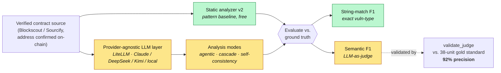
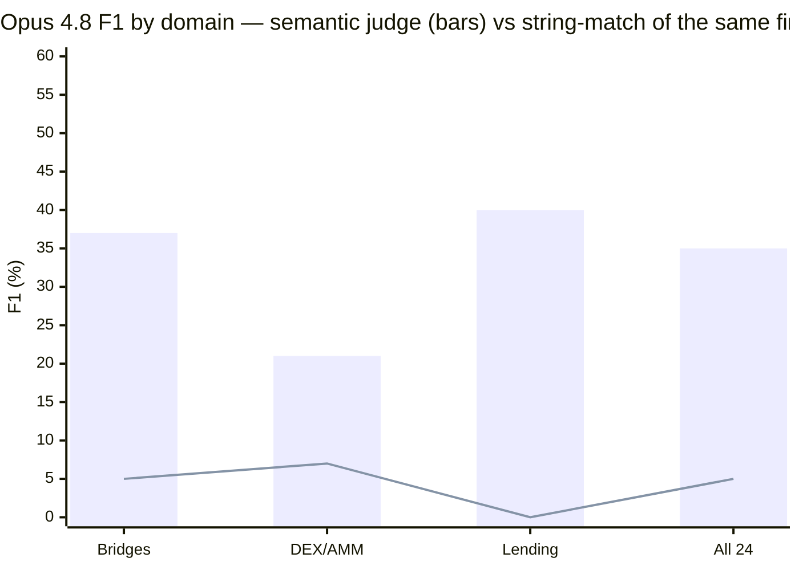
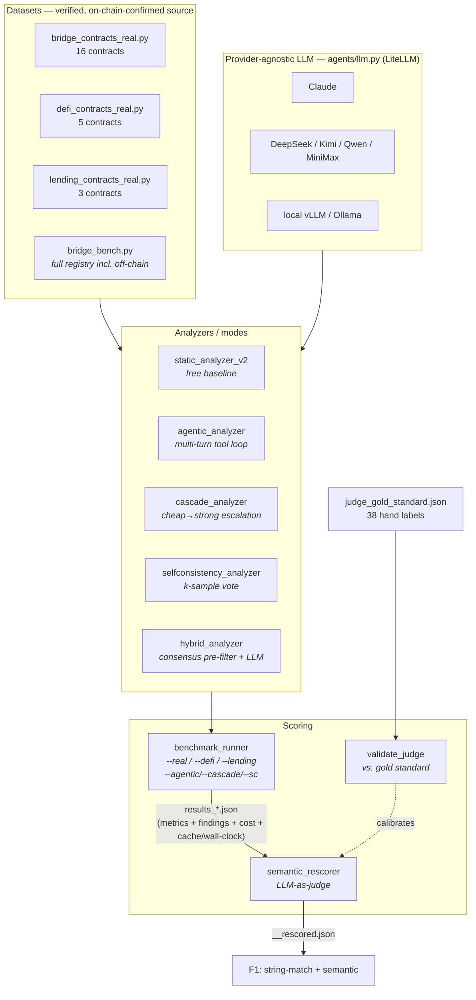

# AI Security Research: measuring detection, not recognition

> **What do LLM vulnerability benchmarks actually measure?**

I built a detection benchmark, scored Opus 4.8 at 35% semantic F1 — then found that **13 of
24 prompts (54%) contained a comment describing the bug**, and 2 stated the ground-truth
label verbatim. The benchmark was partly scoring the model's ability to read a comment.

**[→ The leakage audit](docs/LEAKAGE_AUDIT.md)** (measured, no API key: `python -m benchmarks.sanitize`)

The fix is shipped and regression-tested; re-measuring the effect is the open experiment:

```bash
BENCH_SANITIZE=stripped python -m agents.benchmark_runner --real --agentic  # Δ = prompt-leakage effect
BENCH_SANITIZE=anon     python -m agents.benchmark_runner --real --agentic  # Δ = memorization effect
```

Everything below is the underlying capability work. **All committed numbers were measured at
`BENCH_SANITIZE=raw`** — i.e. under the leakage above — and are contaminated upper bounds
until re-run.

---

## The Problem

**Static analysis fails on real contracts:**
- ✓ 55% F1 on clean, synthetic code
- ✗ 0% F1 on real contracts (with proxies, inheritance, custom patterns)

**Why?** Real code is structurally different. Vulnerabilities are compositional (flash loan + oracle + reentrancy = one exploit path). Pattern matching alone is insufficient.

---

## How it works


```mermaid
flowchart LR
    SRC["Verified contract source<br/>(Blockscout / Sourcify,<br/>address confirmed on-chain)"]
    SRC --> STATIC["Static analyzer v2<br/><i>pattern baseline, free</i>"]
    SRC --> LLM["Provider-agnostic LLM layer<br/><i>LiteLLM · Claude / DeepSeek / Kimi / local</i>"]
    LLM --> MODES["Analysis modes<br/><i>agentic · cascade · self-consistency</i>"]
    STATIC --> EVAL{{"Evaluate vs.<br/>ground truth"}}
    MODES --> EVAL
    EVAL --> STR["String-match F1<br/><i>exact vuln-type</i>"]
    EVAL --> SEM["Semantic F1<br/><i>LLM-as-judge</i>"]
    SEM -.validated by.-> GOLD["validate_judge<br/>vs. 38-unit gold standard<br/><b>92% precision</b>"]

    classDef paid fill:#fde68a,stroke:#b45309,color:#111;
    classDef free fill:#bbf7d0,stroke:#15803d,color:#111;
    class LLM,MODES,SEM paid;
    class STATIC,STR free;
```

Every contract is analyzed two ways (static baseline + agentic LLM), and every LLM run is
scored two ways (exact-string **and** a *validated* semantic judge) — so the gap between
"found the bug" and "named it the way the label expects" is measured, not hidden.

**Measured run (June 2026) on 16 real verified contracts with committed source:**

Scored over the 16 real-source contracts (Opus run, `--real --agentic`):

| Approach | Precision | Recall | F1 | TP / FP / FN |
|----------|-----------|--------|----|--------------|
| Static v2 (pattern baseline)\* | 1% | 2% | **~1%** | 1 / 188 / 45 |
| **Opus 4.8 — string-match scoring** | 4% | 7% | **5%** | 3 / 80 / 38 |
| **Opus 4.8 — semantic-judge scoring** | 28% | **56%** | **37%** | 23 / 60 / 18 |
| Fable 5 agentic | — | — | n/a | refusals in *uncommitted* manual runs — see note |
| Sonnet 4.6 (historical, unreproduced) | — | — | ~40–45% | original claim; never committed |

\* `real_static` from the committed Opus run file (`results_real__claude-opus-4-8.json`),
scored over the real-source set; the standalone static pass (`results_real.json`) scores
0 / 56 / 19 (0% F1). The pattern baseline is **~0% F1 on real contracts either way** — that is
Key Finding #1, not a typo. (An earlier version of this table mistakenly duplicated the Opus
string-match row here.)

> **Why two Opus rows.** The benchmark's evaluator does near-exact string matching on
> vuln-type names. Opus 4.8 emits **compound, descriptive** finding names (e.g.
> `"arbitrary_external_call / approval_drain"`, `"forged_deposit_event /
> unauthenticated_memo"`, `"solvency_check_bypass"`, `"missing_message_source_validation"`)
> that are semantically correct but score as false positives — collapsing recall to 7%.
> `semantic_rescorer.py` (an LLM-as-judge, default Haiku) recomputes F1 from the
> **already-saved findings with no model re-run** (38 judge calls, ~17k tokens, ~$0.02):
> recall rises to **56%**, F1 to **37%**, with a correct root-cause hit on **15 of 16
> contracts** (only `sonne` is a genuine miss; the judge stays conservative on
> `nomad`/`penpie`, so it is not rubber-stamping). The residual false positives are
> mostly real-but-unlabeled observations (centralization, missing timelocks). This is
> the **ground-truth/scoring methodology problem** (Key Findings #2) reproduced at
> frontier-model scale: the model is far better than the matcher reports.

> **The judge is calibrated.** `agents/validate_judge.py` scores the Haiku judge against
> a frozen 38-unit hand-labeled gold standard (`benchmarks/judge_gold_standard.json`):
> **82% accuracy, 92% precision, 83% recall, Cohen's κ = 0.54, 97% run-to-run unanimous.**
> High precision ⇒ the judge rarely fabricates a match, so it does not inflate the model;
> its errors are conservative under-credits, making the **37% a lower bound**. The
> residual disagreement (moderate κ) sits almost entirely on labels flagged *borderline*
> in the gold file — genuine ambiguity, not judge noise.
>
> **What this calibration does *not* cover (read before trusting 37%).** (1) It is
> **in-sample**: the 38 gold units are exactly the 38 miss-decisions the judge is scored on
> for this bridge run — a self-consistency check, not held-out validation. (2) The 92%
> precision is over **n = 26 predicted-positives**, a wide interval (Wilson 95% CI ≈
> [0.76, 0.98]); κ = 0.54 sits only ~6 points above an always-say-match baseline (76%
> positive base rate). (3) The judge scores label-vs-label similarity and **never sees the
> contract source**, so it cannot confirm a finding is actually correct about the code. (4)
> There is **no separate gold standard for the DEX/lending domain**, which is nonetheless
> reported at ~30% semantic F1. Treat the semantic numbers as a signal with a real error
> bar, not a measured constant.

> **Two model-specific observations (one anecdotal — flagged as such).**
> 1. **Fable 5 declined the task in manual testing — _not committed, treat as anecdotal._**
>    In uncommitted manual runs the newest model returned refusals (empty output) on the
>    smart-contract vulnerability-analysis prompt where Sonnet/Opus engaged. **This is not
>    reproduced in the committed harness**: no result file records it, and the current tool
>    loop reads LiteLLM's `finish_reason` rather than a `refusal` stop reason, so there is no
>    saved artifact to cite. If real, it points at a genuine safety-tuning-vs-defensive-utility
>    tension worth studying properly — but as it stands it is an observation, not a result.
>    (The two committed system prompts are generic auditor framings; a dedicated
>    authorized-defensive-audit prompt and a committed Fable run are future work.)
> 2. **Newer models omit `temperature`.** `agents/llm.py` skips the explicit `temperature`
>    override for `claude-fable-5` and `claude-opus-4-8` (observed to reject it in testing)
>    and keeps `temperature=0` only where supported. This one is in code
>    (`_supports_temperature`), though the underlying 400 is not saved as a trace.

> **Dataset status.** 16 of 20 registered contracts now have **real verified source**
> committed (fetched from Blockscout/Sourcify, addresses confirmed on-chain), up from
> 3. Remaining empties (`poly_network`, `ronin`, `orbit`, `lifi_march_2022`) are either
> verified only on Etherscan (needs a key) or off-chain key-compromise hacks with no
> source-level bug to detect. Select a model with `BENCH_MODEL` (`sonnet` default,
> `opus`, `haiku`, `fable`); non-default models write `results_real__<model>.json`.

---

## Multi-domain result (Opus 4.8, semantic-judge scoring)

The same agentic harness, run across **24 verified contracts in three domains** (57
labeled vulnerabilities), then scored by the validated semantic judge:

| Domain | Contracts | String-match F1 | **Semantic F1** | Semantic recall |
|--------|-----------|-----------------|-----------------|-----------------|
| Bridges | 16 | 5% | **37%** | 56% |
| DEX/AMM | 5 | 7% | **21%** | 38% |
| Lending | 3 | 0% | **40%** | 62% |
| **All three** | **24** | **5%** | **35%** | **54%** |

*(Regenerate this table from committed JSON any time: `python -m agents.report`.)*


```mermaid
xychart-beta
    title "Opus 4.8 F1 by domain — semantic judge (bars) vs string-match of the same findings (line)"
    x-axis ["Bridges", "DEX/AMM", "Lending", "All 24"]
    y-axis "F1 (%)" 0 --> 60
    bar [37, 21, 40, 35]
    line [5, 7, 0, 5]
```

Both columns score the **same Opus 4.8 findings**: exact-string matching gives ~5% F1, the
validated semantic judge gives **35% F1 / 54% recall** — a ~7× gap that measures the
*evaluator*, not the model. (Separately, the pattern-based static analyzer scores ~0% F1 on
these contracts — the real weak baseline.) DEX is the hardest domain (Curve is a Vyper
compiler bug invisible to a Solidity reader; KyberSwap is a subtle tick-precision bug). Cost
of the DEX+lending pass: **$16.29** (Opus 4.8 agentic, 8 contracts, budget-capped at $20 via
`agents/budget_run.py`; per-contract token cost and dollar amounts are persisted in the
result files).

---

## Models & analysis modes

The analyzers are **provider-agnostic** via [LiteLLM](https://github.com/BerriAI/litellm):
the same tool-use loop runs on Claude, DeepSeek, Kimi, Qwen, MiniMax, GLM, or **any local
OpenAI-compatible server** (vLLM / Ollama / SGLang). It's an MIT translation layer — no
router, no per-token markup — so requests go straight to the provider or to a model inside
your own network, and contract source need never leave the box. Select with `BENCH_MODEL`;
output is stamped per model so baselines are never overwritten.
See **[MULTI_MODEL.md](docs/MULTI_MODEL.md)**.

Four analysis modes, all behind the same evaluator + validated judge:

| Mode | Flag | Optimizes for |
|------|------|---------------|
| **Agentic** | `--agentic` | the measured baseline (multi-turn tool loop, one model) |
| **Cascade** | `--cascade` | **cost** — a cheap model triages, the strong model deep-dives only flagged functions |
| **Self-consistency** | `--sc` | **precision** — k samples, keep majority-vote findings |
| **Large-context** | *(automatic)* | **recall** — big-context models read whole contracts instead of regex-extracted functions |

Cost/latency optimizations apply across every mode: **prompt caching** (~50–75% input-token
cut on the multi-turn loop), **concurrency** (`BENCH_CONCURRENCY`), and **retries/timeouts**.
See **[OPTIMIZATION.md](docs/OPTIMIZATION.md)**.

> **Measured vs. shipped.** Only the committed Opus 4.8 agentic run has measured F1. The
> multi-model layer and the cascade / self-consistency / large-context modes are **shipped
> and unit-verified**, but their F1/cost deltas are **not yet measured against a live key**.
> The instrumentation (cached tokens, wall-clock, per-tier cost) is in place to quantify them
> on the next run.

---

## Key Findings

**0. The benchmark was leaking the answer into the prompt.** 13 of 24 contracts' provenance
headers describe the bug in prose; 2 state the ground-truth label verbatim. On Euler the
model's scored true positive (`missing_solvency_check`) is the exact string in the header,
and the vulnerable function isn't even in the committed source. Every finding below was
measured under that condition. Found by printing the literal prompt and grepping it — see
[LEAKAGE_AUDIT.md](docs/LEAKAGE_AUDIT.md). This is the most important result in this repo,
and it is a negative one about my own work.

**1. Compositional vulnerabilities require multi-turn reasoning.** Flash loan + oracle
manipulation + reentrancy is a single multi-step exploit path. On real contracts the
static baseline scores ~1–5% F1; an agentic LLM reading the same source identifies the
actual root cause on **15 of 16** bridge contracts (see the results table above).

**2. The evaluator, not the model, is often the bottleneck.** Exact-string scoring rated
Opus 4.8 at 5% F1; an LLM-judge that scores *semantic* equivalence — validated against a
hand-labeled gold standard at 92% precision — recovers **37% F1 / 56% recall**. Benchmarks
that match vuln names literally systematically understate strong models.

**3. Frontier models may disagree on whether to do the task at all (anecdotal).** Opus 4.8
engages; in *uncommitted* manual testing Fable 5 returned refusals on the same prompt. This
is **not reproduced in the committed harness** and has no saved artifact — treat it as an
observation to investigate, not a result. If it holds up, safety-tuning vs. defensive-security
utility is a real tension worth a proper study.

**4. Dataset quality is a first-class problem.** A post-mortem audit
([docs/DATA_QUALITY.md](docs/DATA_QUALITY.md)) found the original DEX/lending labels were
partly wrong (non-existent events, market/oracle events mislabeled as code bugs, conflated
hacks). The lending domain was rebuilt around verified source bugs before any number was
reported — generalization claims are only as good as the labels behind them.

---

## Datasets (verified, source-committed)

All source is fetched from public verifiers (Blockscout / Sourcify) with **every address
confirmed on-chain**. "Source" = a real verified contract committed to `benchmarks/contracts/`.

| Domain | Loader | Source-committed | Examples |
|--------|--------|------------------|----------|
| **Bridges** | `bridge_contracts_real.py` | **16 / 20** | Nomad, Qubit, Socket, XBridge, LiFi, Allbridge, THORChain, Rubic, CrossCurve, Hyperbridge, Penpie, Seneca, Prisma, Sonne, Dough, Abracadabra |
| **DEX/AMM** | `defi_contracts_real.py` | **5 / 5** | Euler (missing solvency check), KyberSwap (tick precision), Platypus (solvency ordering), DODO (unprotected init), Curve (Vyper stand-in) |
| **Lending** | `lending_contracts_real.py` | **3 / 3** | Onyx oPEPE (rounding), Compound P062 (reward-accounting), Cream crAMP (ERC-777 reentrancy) |

**24 verified, correctly-labeled source contracts** across three domains.

A separate registry, `bridge_bench.py`, tracks **off-chain** mega-hacks (Ronin, KelpDAO,
Humanity Protocol, …) for loss-coverage only — they have no source-level bug to detect and
are excluded from the F1 eval. See [DATA_QUALITY.md](docs/DATA_QUALITY.md) for what was
corrected and what remains to fetch (KyberSwap, Platypus, DODO).

---

## Quick Start

```bash
# 1. Setup (Python 3.10+)
python3 -m venv .venv && source .venv/bin/activate
pip install -r requirements.txt
export ANTHROPIC_API_KEY=sk-...

# 2. Static baseline (free, no API)
python3 -m agents.benchmark_runner --real

# 3. Agentic run — pick the model with BENCH_MODEL (sonnet default, opus, haiku, fable)
#    Non-default models write results_real__<model>.json (baselines never clobbered)
BENCH_MODEL=opus python3 -m agents.benchmark_runner --real --agentic

# 4. Other domains (same evaluation path)
BENCH_MODEL=opus python3 -m agents.benchmark_runner --defi --lending --agentic

# 5. Semantic re-score (LLM-as-judge; recomputes F1 from saved findings, no model re-run)
python3 -m agents.semantic_rescorer results_real__claude-opus-4-8.json

# 6. Validate the judge against the frozen gold standard
python3 -m agents.validate_judge
```

**Cheaper / local models and optimized modes** (provider-agnostic via LiteLLM):

```bash
# Cheaper hosted model — your own key, no middleman
BENCH_MODEL=deepseek DEEPSEEK_API_KEY=... python3 -m agents.benchmark_runner --real --agentic

# Local model — contract source never leaves your network
LLM_BASE_URL=http://localhost:8000/v1 BENCH_MODEL=local \
  python3 -m agents.benchmark_runner --real --agentic

# Cost-optimized cascade: cheap wide-net -> focused strong-model escalation
CASCADE_CHEAP_MODEL=deepseek CASCADE_STRONG_MODEL=opus \
  python3 -m agents.benchmark_runner --real --cascade

# Precision-optimized self-consistency: k samples, keep majority-vote findings
SC_SAMPLES=3 BENCH_MODEL=opus python3 -m agents.benchmark_runner --real --sc

# Throughput: analyze contracts in parallel (prompt caching + retries are automatic)
BENCH_CONCURRENCY=8 BENCH_MODEL=opus python3 -m agents.benchmark_runner --real --agentic
```

---

## Architecture


```mermaid
flowchart TB
    subgraph data["Datasets — verified, on-chain-confirmed source"]
        direction LR
        B["bridge_contracts_real.py<br/>16 contracts"]
        D["defi_contracts_real.py<br/>5 contracts"]
        L["lending_contracts_real.py<br/>3 contracts"]
        REG["bridge_bench.py<br/><i>full registry incl. off-chain</i>"]
    end

    subgraph llmlayer["Provider-agnostic LLM — agents/llm.py (LiteLLM)"]
        direction LR
        MC["Claude"]
        MO["DeepSeek / Kimi / Qwen / MiniMax"]
        ML["local vLLM / Ollama"]
    end

    subgraph analyze["Analyzers / modes"]
        direction LR
        SA["static_analyzer_v2<br/><i>free baseline</i>"]
        AA["agentic_analyzer<br/><i>multi-turn tool loop</i>"]
        CA["cascade_analyzer<br/><i>cheap→strong escalation</i>"]
        SC["selfconsistency_analyzer<br/><i>k-sample vote</i>"]
        HA["hybrid_analyzer<br/><i>consensus pre-filter + LLM</i>"]
    end

    subgraph score["Scoring"]
        direction LR
        BR["benchmark_runner<br/><i>--real / --defi / --lending<br/>--agentic/--cascade/--sc</i>"]
        SR["semantic_rescorer<br/><i>LLM-as-judge</i>"]
        VJ["validate_judge<br/><i>vs. gold standard</i>"]
    end

    data --> analyze
    llmlayer --> analyze
    analyze --> BR
    BR -->|"results_*.json<br/>(metrics + findings + cost + cache/wall-clock)"| SR
    SR -->|"__rescored.json"| OUT["F1: string-match + semantic"]
    GOLD["judge_gold_standard.json<br/>38 hand labels"] --> VJ -.calibrates.-> SR
```

**Key design choices**
- **Two-axis scoring.** Exact-string F1 catches the literal match; a *validated* LLM-judge
  catches semantically-correct compound names. Reporting both makes the evaluator's bias visible.
- **Provenance everywhere.** Every `.sol` header records the verified address + chain + how it
  was fetched; off-chain key-compromise hacks are quarantined in `bridge_bench.py`.
- **Reproducible & budget-aware.** Per-contract token + dollar cost is persisted; `budget_run.py`
  caps spend and saves after every contract.
- **Provider-agnostic.** One LiteLLM path (`agents/llm.py`) runs any hosted or local model;
  `BENCH_MODEL` selects it and results are stamped per model so baselines are never overwritten.
- **Cost/perf built in.** Prompt caching, contract-level concurrency, and retries/timeouts apply
  to every mode; cached-token and wall-clock figures are persisted alongside cost.

| Layer | Files |
|-------|-------|
| Datasets | `benchmarks/{bridge,defi,lending}_contracts_real.py`, `bridge_bench.py`, `contracts/*.sol` |
| Model layer | `agents/llm.py` (LiteLLM: caching, retries, model registry, context budget) |
| Analyzers | `agents/{static_analyzer_v2,agentic_analyzer,cascade_analyzer,selfconsistency_analyzer,hybrid_analyzer}.py` |
| Scoring | `agents/{benchmark_runner,semantic_rescorer,validate_judge,budget_run}.py` |
| Gold standard | `benchmarks/judge_gold_standard.json` (38 hand-labeled decisions) |

---

## Reproducing the headline run

The committed `results_real__claude-opus-4-8.json` (+ `__rescored.json`) is the Opus 4.8
agentic pass over the 16 bridge contracts. `results_defi_lending__claude-opus-4-8.json`
(+ `__rescored.json`) is the Opus 4.8 **agentic** pass over the 8 DEX+lending contracts
(`_run.spent_usd = 16.29`) — both the static and agentic rows for those domains live in that
file. To regenerate from scratch you need an API key with credit; static passes are free.
Costs are dominated by the largest contracts (Penpie ~184 KB).

---

## Honest limitations

- **Every committed number was measured with the answer partly in the prompt.** 13 of 24
  provenance headers describe the bug; 2 name the label. Treat all F1 below as contaminated
  upper bounds until re-run at `BENCH_SANITIZE=stripped`. Details and the Euler case study:
  [LEAKAGE_AUDIT.md](docs/LEAKAGE_AUDIT.md).
- **One contract's labeled bug is absent from its own source.** Euler's committed file is the
  module bundle, not the `EToken` module holding `donateToReserves`, so its ground truth is
  not findable from the supplied code at all. Not yet fixed (needs the right source fetched).
- **Training-data contamination is the second threat to validity — tooling now exists, the
  experiment has not been run.** Every contract here is a *famous* historical exploit whose public
  post-mortem is almost certainly in the model's training data, so "Opus finds the Euler
  donation bug" is confounded by memorization of the Euler write-up. These numbers are
  **detection-under-possible-leakage**, not clean capability measurement. The key open
  experiment — a contamination control (identifier/constant perturbation, or genuinely
  post-cutoff contracts, measuring the F1 delta) — has **not been run**; it is specified in
  advance in **[docs/CONTAMINATION.md](docs/CONTAMINATION.md)**. Read every number below with
  that caveat.
- **The semantic judge's calibration is in-sample, small-n, and source-blind.** The 92%
  precision / κ = 0.54 is measured on the *same* 38 decisions it then scores (not held out),
  over n = 26 positives (95% CI ≈ [0.76, 0.98]); the judge never reads the contract, so it
  scores label-vs-label similarity, not whether a finding is truly correct. No separate gold
  standard exists for DEX/lending. Treat 35–37% F1 as a direction with a real error bar.
- **The string-match scorer is deliberately lenient** and some of its equivalences were added
  after observing model outputs, so string-match F1 is a soft floor, not a neutral baseline.
- **Ground truth is hand-authored** (single annotator). The gold standard and fuzzy
  equivalences encode the author's judgment; a second labeler would let us report
  inter-human agreement.
- **Some DEX source is a faithful stand-in, not the exploited instance**: KyberSwap uses a
  verified same-implementation pool (Optimism, pre-patch) and DODO uses the verified clone
  template, because the exploited factory-deployed instances are unverified on-chain. Curve
  is a Vyper bug with no Solidity equivalent (counted toward "5/5 source" but excluded from
  F1). The lending Cream positive uses a post-hack *patched* impl (a softer positive).
- **No committed Sonnet baseline** on the full set yet, so the Opus number lacks a same-set
  head-to-head. The Opus agentic run now covers all three domains (bridges committed first,
  DEX+lending in `results_defi_lending__claude-opus-4-8.json`), but n is small: effectively
  16 bridges + ~4 clean DEX + ~2 clean lending after exclusions.

---

## Reproduce & verify (no API key)

```bash
python -m benchmarks.validate_dataset   # dataset integrity (also runs in CI)
python -m pytest tests/ -q              # eval-logic + integrity unit tests
python -m agents.report                 # regenerate the results tables from committed JSON
```

## Documentation

- **[RESEARCH.md](docs/RESEARCH.md)** — full methodology and phase-by-phase findings (incl. Phase 7)
- **[MULTI_MODEL.md](docs/MULTI_MODEL.md)** — provider-agnostic models, local/self-host deployment, the bake-off
- **[OPTIMIZATION.md](docs/OPTIMIZATION.md)** — prompt caching, concurrency, cascade, self-consistency, large-context
- **[DATASHEET.md](docs/DATASHEET.md)** — Datasheet-for-Datasets: provenance, composition, limitations
- **[LEAKAGE_AUDIT.md](docs/LEAKAGE_AUDIT.md)** — the prompt-leakage finding, the Euler case study, and the sanitizer
- **[CONTAMINATION.md](docs/CONTAMINATION.md)** — the memorization confound and the pre-registered experiment to measure it
- **[DATA_QUALITY.md](docs/DATA_QUALITY.md)** — the DEX/lending label audit and corrections
- **[writeups/multi_domain_analysis.md](writeups/multi_domain_analysis.md)** — what Opus catches vs. misses, per contract
- **[INDEX.md](docs/INDEX.md)** — documentation map

---

## License

MIT — see LICENSE.

**Status:** bridges complete (16 verified contracts, validated semantic rescorer); DEX
partial; lending rebuilt. Harness is now provider-agnostic (LiteLLM) with cost/perf
optimization (caching, concurrency) and cascade / self-consistency / large-context modes —
shipped and unit-verified, measurement pending a live multi-model run. Last updated June 2026.
