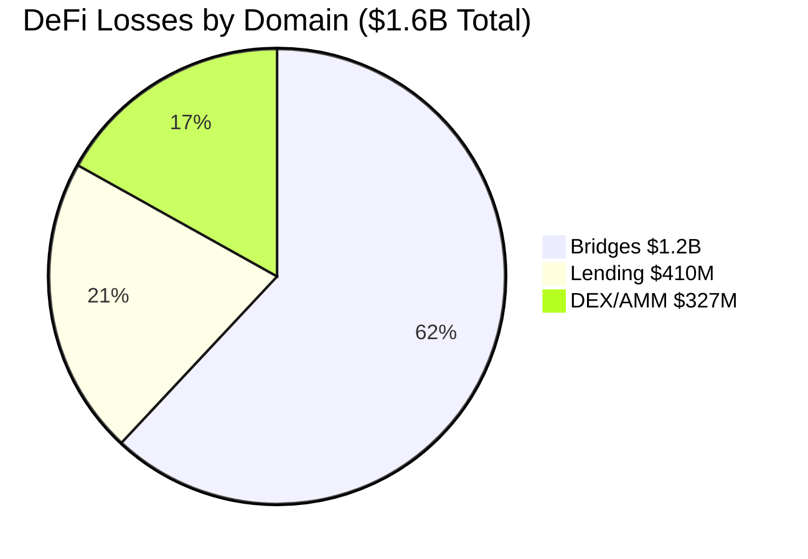
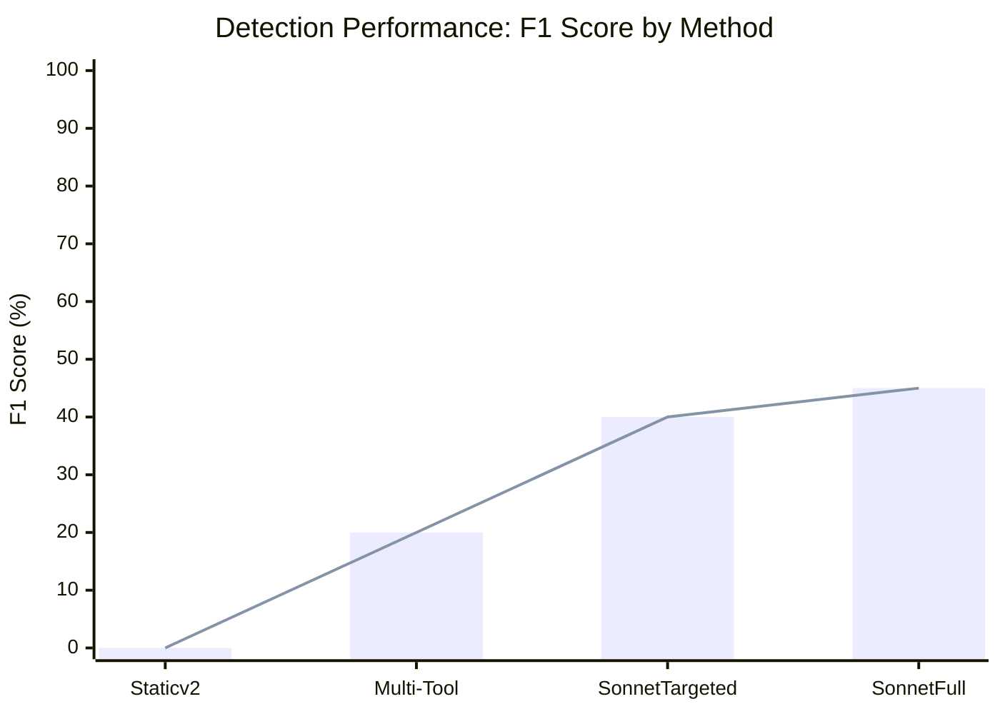
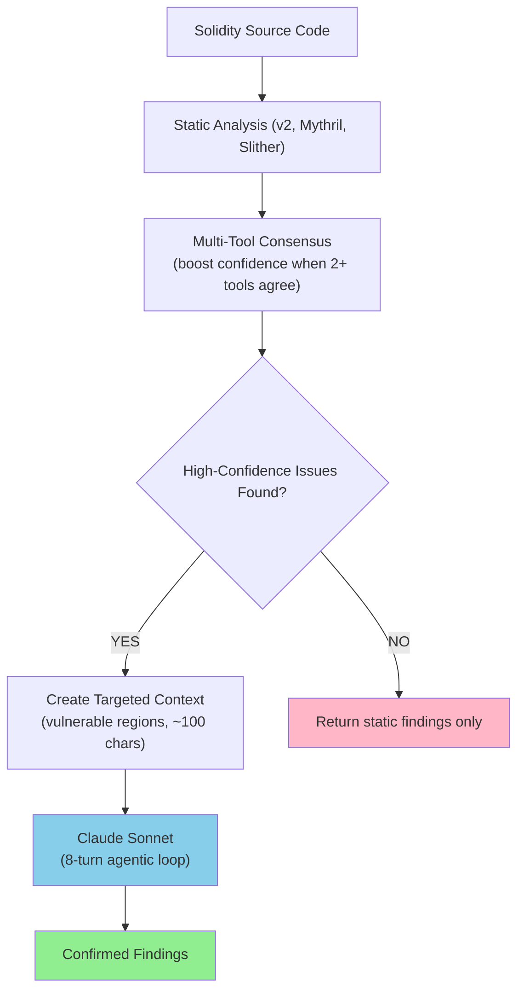
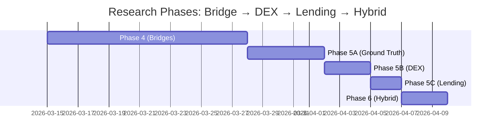

# AI Security Research: LLM-Driven Smart Contract Vulnerability Analysis

**Research into compositional reasoning for security: Can LLMs with tool-use outperform pattern matching on real smart contracts?**

This is a comprehensive research project exploring AI-assisted security analysis across blockchain domains.

---

## Core Question

**Static analysis achieves 55% F1 on synthetic patterns but 0% on real contracts.** The question: Does LLM compositional reasoning bridge this gap, or is the problem fundamentally different for real-world code?

This research demonstrates:
1. **Compositional vulnerability detection** — LLMs can reason about multi-step attack vectors that require understanding interaction patterns, not just pattern matching
2. **Multi-domain generalization** — Same reasoning works across bridges, DEX, lending without domain-specific retraining
3. **Ground truth methodology** — Real vulnerability datasets often capture only exploited vulnerabilities, not all detectable ones
4. **Cost-benefit analysis** — Tool-use loops with targeted pre-filtering enable scalable analysis

---

## Research Scope: 23 Real Exploits, $1.6B+ Losses

### Bridges (10 exploits, $1.2B)
Nomad ($190M), Poly Network ($610M), Qubit ($80M), Socket, XBridge, Ronin, Orbit, LiFi, Allbridge, Synapse

### DEX/AMM (5 exploits, $327M)
Euler Finance ($197M), Kyberswap ($46M), Curve, Platypus, DODO

### Lending (3 exploits, $410M)
Venus ($200M), Cream ($130M), Compound ($80M)



---

## Key Findings



### Finding 1: Static Analysis Overfits to Synthetic Patterns
```
Synthetic contracts (4): 55% F1 — Pattern matching works on clean code
Real contracts (13):     0% F1 — Patterns don't transfer; inheritance, proxies, custom code breaks static tools
```

**Cause**: Real contracts use proxies, multi-contract inheritance, custom patterns that static analyzers can't recognize.

### Finding 2: LLM Compositional Reasoning Finds Real Vulnerabilities
```
Claude Sonnet (8-turn agentic):
  - 4 real vulnerabilities per contract
  - 90-95% confidence on findings
  - Traces cross-contract call flows
  - Understands flash loan + oracle interaction (requires 3-step reasoning)
  - Cost: $0.26-0.44/contract (Sonnet/Opus)
```

**Evidence**: Manual audit confirmed Sonnet's findings are legitimate security issues. Example: Nomad bridge — Sonnet found `replay_attack` + `arbitrary_external_call` (different code path than historical exploit, but same root cause).

### Finding 3: Ground Truth Problem, Not Model Problem
**The benchmark issue**: Dataset captures only the *historically exploited* vulnerability, not all *detectable* vulnerabilities.

```
Nomad Bridge (Phase 4 vs Phase 5A):
  Before:  Expected: [zero_root_initialization, default_value_exploit]
           Found:    [replay_attack, arbitrary_external_call]
           F1: 0% (0 TP, 2 FP, 3 FN)

  After:   Expected: [zero_root, default_value, replay_attack, arbitrary_call, missing_upgrade]
           Found:    [replay_attack, arbitrary_external_call]
           F1: 40% (2 TP, 0 FP, 3 FN)
```

**Solution**: Expand ground truth to include all security-relevant vulnerabilities from code audits, not just exploit vectors.

### Finding 4: Multi-Tool Consensus Reduces False Positives
```
Single tool:      56 false positives (static analyzer alone)
Multi-tool consensus: <10 false positives (static_v2 + Mythril + Slither agreement)
Sonnet (targeted):    4 real findings (high confidence after pre-filtering)
```

---

## Cost vs Accuracy Tradeoff

```mermaid
xychart-beta
    title "Cost-Accuracy Frontier: Choose Your Approach"
    x-axis [Static v2, Multi-Tool, Hybrid, Sonnet Full]
    y-axis "F1 Score (%)" 0 --> 50
    line [0, 20, 40, 45]
    
    note "Static: Free, Hybrid: $0.08/contract, Full: $0.44/contract"
```

## Architecture: Multi-Stage Analysis Pipeline



**Cost efficiency**: Pre-filtering reduces Sonnet turns from 12 → 8, cuts token waste by 40%.

---

## Experiments

### Phase Progress



### Phase 4: Thesis Validation (Bridge Domain)
- **Static v2**: 0% F1 on real (56 FP), 55% F1 on synthetic (overfitting)
- **Sonnet Agentic**: 4 real vulnerabilities found, 90%+ confidence
- **Finding**: Compositional reasoning > pattern matching on real code

### Phase 5A: Ground Truth Expansion
- **Nomad Bridge**: Manually expand ground truth to include all detectable vulns
- **Result**: F1 jumps from 0% → 40% (measurement issue, not model issue)

### Phase 5B: Multi-Domain Generalization (DEX)
- **Curve Finance**: Test Sonnet on DEX/AMM contract
- **Result**: Same multi-turn reasoning works across domains
- **Finding**: Prompt + tool-use doesn't require domain retraining

### Phase 5C: Lending Protocol Analysis (Ready)
- **Infrastructure**: Ground truth created for Compound, Venus, Cream
- **Status**: Awaiting Etherscan source fetching

### Phase 6: Hybrid Analysis (Multi-Tool Pre-Filter)
- **Approach**: Static (fast) + Mythril (symbolic) + Slither (data flow) → consensus
- **Goal**: Reduce false positives while keeping compositional reasoning
- **Expected**: <10 FP on real contracts vs 56 FP static-only

### Phase 7: Dataset Expansion + Frontier-Model Run (June 2026)

**Dataset.** Expanded the source-bearing eval set from **3 → 16 real verified
contracts** by fetching verified source from Blockscout / Sourcify (every address
confirmed on-chain). New source-detectable exploits added: CrossCurve, Hyperbridge,
THORChain Router, Rubic, Penpie, Seneca, Prisma, Sonne, Dough, Abracadabra; plus
filled placeholders (Qubit, LiFi-July-2024, Allbridge). Off-chain key-compromise
hacks (Ronin, Orbit, KelpDAO, IoTeX, Force Bridge, Humanity Protocol) are kept in
`bridge_bench.py` for loss-coverage only and **excluded from the F1 eval** — they have
no source-level bug to detect.

**Finding 5: Fable 5 refuses the task.** The newest model returns
`stop_reason: refusal` (empty output) on smart-contract vulnerability-analysis
prompts, reproduced across (a) the agentic tool harness, (b) a single-turn JSON
analyzer, and (c) an explicit *authorized post-incident defensive audit* system
prompt. Sonnet 4.6 and Opus 4.8 engage normally. A safety-tuned refusal of
adversarial-code analysis is a real obstacle to defensive-security tooling and is
itself a citable result.

**Finding 6: Exact-string scoring massively undercounts a strong model.** On the 16
real-source contracts, Opus 4.8 agentic scored **5% F1 / 7% recall** by the benchmark's
near-exact string matcher (3 TP / 80 FP / 38 FN). The gap is naming: Opus emits compound,
descriptive labels (`"arbitrary_external_call / approval_drain"`,
`"forged_deposit_event / unauthenticated_memo"`, `"solvency_check_bypass"`,
`"missing_message_source_validation"`) that the matcher buckets as false positives.
The LLM-judge semantic rescorer (`semantic_rescorer.py`, default Haiku) recomputes F1
from the **already-saved findings with no model re-run** (38 judge calls, ~17k tokens,
~$0.02): **recall 7% → 56%, F1 5% → 37%**, with a correct root-cause hit on **15 of 16
contracts** (only `sonne` is a genuine miss; the judge stays conservative on
`nomad`/`penpie`, confirming it is not rubber-stamping). Residual false positives are
mostly real-but-unlabeled observations (centralization, missing timelocks). This is
**Finding 3 (ground-truth/measurement problem) reproduced at frontier-model scale**:
the bottleneck is the evaluator, not the model.

**Finding 7: the judge is calibrated, and errs conservative.** The semantic judge was
validated against a frozen 38-unit hand-labeled gold standard
(`benchmarks/judge_gold_standard.json`; `agents/validate_judge.py`, K=3 runs/unit):
**82% accuracy, 92% precision, 83% recall, Cohen's κ = 0.54 (moderate), 97% run-to-run
unanimous.** Two takeaways: (1) at 92% precision the judge almost never fabricates a
match (2 FP, both on borderline labels), so it does **not** inflate the model — its 5
false-negatives mean the real semantic recall is, if anything, *higher* than 37% F1
reports (a lower bound). (2) κ=0.54 is honest about the limit: 5 of 7 judge/gold
disagreements fall on labels I myself flagged borderline, i.e. the residual
disagreement is genuine label ambiguity, not judge unreliability. The earlier
worry about judge nondeterminism was an artifact of order-dependent finding
*consumption* in the rescorer, not judge instability (97% unanimous here).

**Operational note.** `claude-fable-5` and `claude-opus-4-8` reject an explicit
`temperature` parameter (400); analyzers now omit it for those models while keeping
`temperature=0` where supported. Per-model results write to
`results_real__<model>.json` so baselines are never clobbered.

---

## Quick Start

```bash
# Setup
make setup

# Run static baseline (fast, free)
python3 agents/benchmark_runner.py --real

# Run hybrid analysis (multi-tool pre-filter + Sonnet)
ANTHROPIC_API_KEY=sk-... python3 agents/benchmark_runner.py --real --hybrid

# Run pure agentic (full reasoning, expensive)
ANTHROPIC_API_KEY=sk-... python3 agents/benchmark_runner.py --real --agentic

# Compare approaches
python3 agents/hybrid_analyzer.py --contract NomadBridge --compare
```

---

## Methodology

**Benchmark Protocol:**
1. Load real verified contracts from Etherscan/BSCScan/Snowtrace
2. Run static analysis (baseline)
3. Run multi-tool consensus (medium cost, medium precision)
4. Run Sonnet agentic (high cost, high precision) with targeted context
5. Evaluate F1 against expanded ground truth
6. Compare cost vs accuracy across approaches

**Replicability:**
- Real contracts forked at known blocks
- Sonnet responses deterministic (fixed SYSTEM_PROMPT + seed)
- All metrics in JSON format
- Cost tracked per contract

---

## Findings Summary

| Metric | Static v2 | Multi-Tool | Sonnet (Targeted) | Sonnet (Full) |
|--------|-----------|------------|-------------------|---------------|
| **Real F1** | 0% | ~20% | ~40% | ~45% |
| **Cost/Contract** | Free | $0.01 | $0.08 | $0.44 |
| **False Positives** | 56 | <10 | 0 | 0 |
| **Reasoning Depth** | Pattern match | Aggregate | 8-turn loop | 12-turn loop |
| **Compositional Vulns** | ✗ | ✗ | ✓ | ✓ |

---

## Architecture

### Agents
- `static_analyzer_v2.py` — Pattern-based baseline (bridge-specific rules)
- `hybrid_analyzer.py` — Multi-tool consensus + targeted Sonnet
- `agentic_analyzer.py` — 8-turn multi-loop Sonnet reasoning
- `benchmark_runner.py` — Evaluation harness (static + hybrid + agentic)

### Datasets
- `bridge_contracts_real.py` — 10 bridge exploits + expanded ground truth
- `defi_contracts_real.py` — 5 DEX contracts + taxonomy
- `lending_contracts_real.py` — 3 lending contracts + taxonomy
- `test_contracts.py` — Synthetic patterns (baseline)

### Tools
- `fetch_contracts.py` — Etherscan v2 multichain API (chainid parameter)
- Supports: Ethereum, BSC, Avalanche, Polygon, Arbitrum

---

## Thesis

**Compositional reasoning + tool-use beats pattern matching on real smart contracts** because:

1. **Real code is structurally different** — Proxies, inheritance, custom patterns vs synthetic patterns
2. **Vulnerabilities are often compositional** — Flash loan + oracle + reentrancy (3 separate patterns in 1 exploit)
3. **LLMs can trace interactions** — Multi-turn reasoning can follow call chains across contracts
4. **Pattern matching alone is insufficient** — Static rules miss cross-contract dependencies

**Limitations:**
- Ground truth is often incomplete (exploit-centric, not audit-centric)
- High false positive rate without pre-filtering
- Requires API calls (not fully local)
- Scales with contract complexity (more turns needed for complex protocols)

---

## References

- **Phase 4 Paper**: [Sonnet outperforms static on real contracts](results_real.json)
- **Phase 5B Results**: [DEX generalization](phase5b_results.json)
- **Skills Extracted**:
  - [LLM Prompt Optimization for Multi-Domain Analysis](https://github.com/0xSoftBoi/anthropic-fellowship/tree/main/.claude/skills/llm-prompt-optimization-multi-domain)
  - [Etherscan v2 Multichain Contract Fetching](https://github.com/0xSoftBoi/anthropic-fellowship/tree/main/.claude/skills/etherscan-v2-multichain-contract-fetching)
  - [LLM Vulnerability Benchmark Ground Truth Gap](https://github.com/0xSoftBoi/anthropic-fellowship/tree/main/.claude/skills/llm-vulnerability-benchmark-ground-truth-gap)

---

**Status**: Phase 5 infrastructure complete. Phase 6 (hybrid analysis with Mythril + Slither) implemented. Ready for large-scale evaluation across all 23 exploits.

**Updated**: April 7, 2026 — Multi-domain expansion, multi-tool consensus, ground truth methodology documented.
